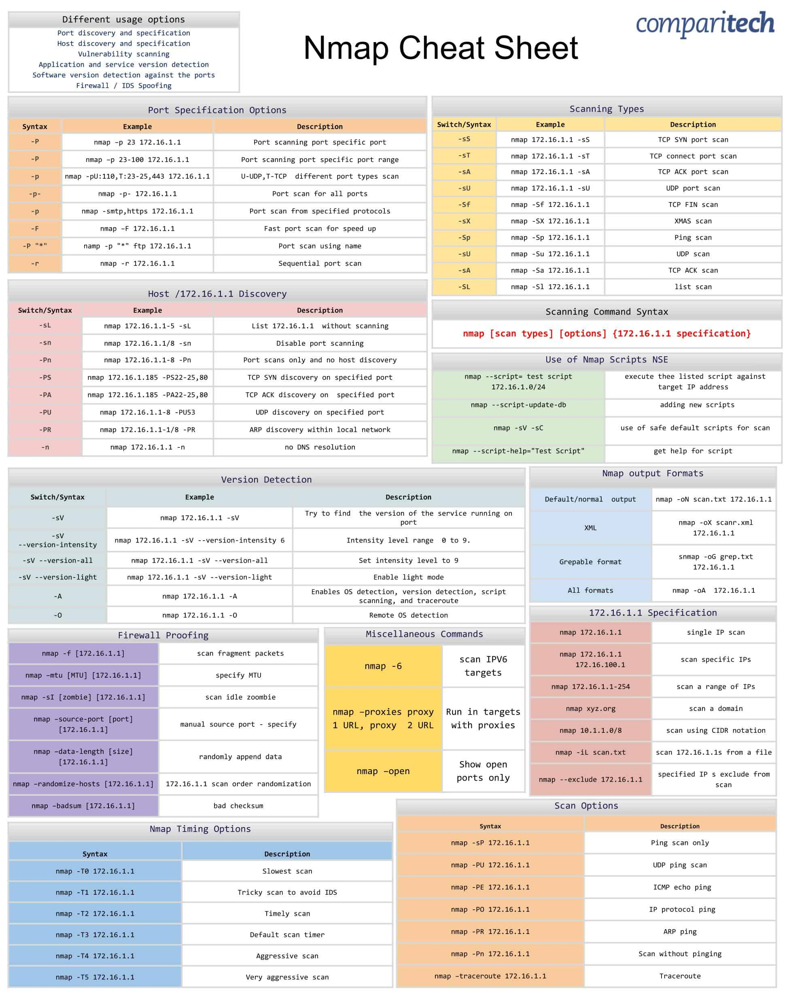

# NMAP

> Nmap (Network Mapper) is the most famous scanning tool used by penetration testers.

It is an open-source Linux command-line tool that is used to scan IP addresses and ports in a network and to detect installed applications. Nmap allows network admins to find which devices are running on their network, discover open ports and services, and detect vulnerabilities.

